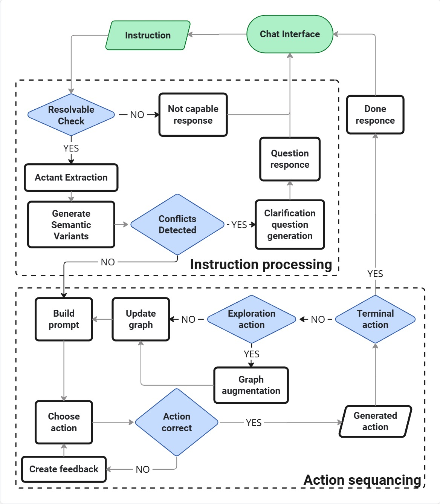
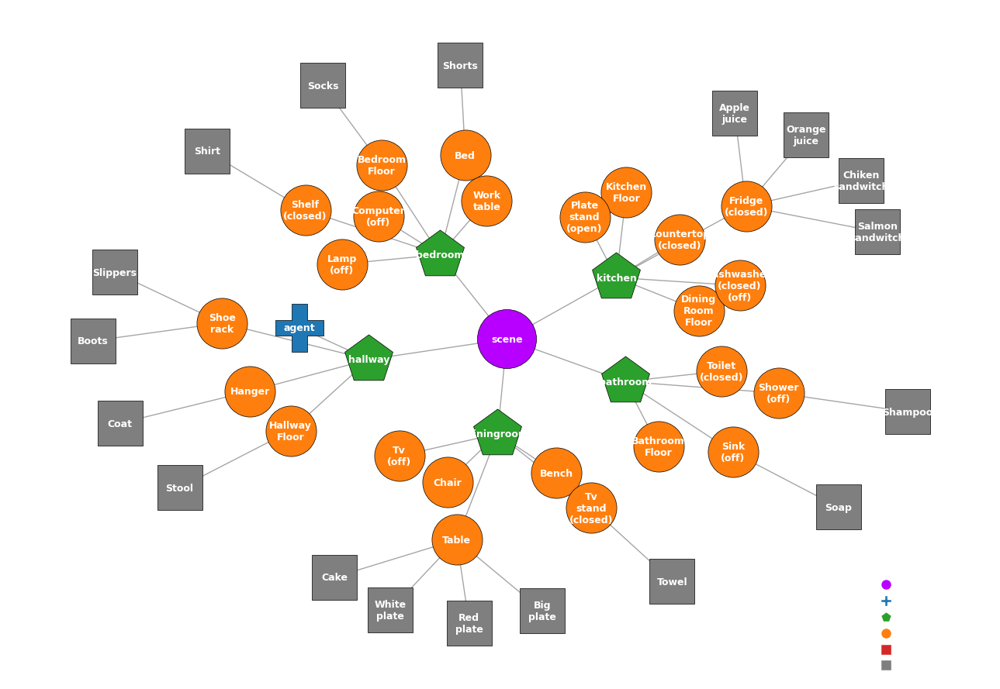

# AGGP: Ambiguity-Guided Graph Planning

Interactive demonstration system for the paper **"Ambiguity-Aware Task Planning over Scene Graphs for Embodied Agents"**.

<div align="center">

<video controls src="https://github.com/user/repo/raw/main/assets/Demo_short.mp4"></video>

*Video demo for Ambiguity-Guided Graph Planning*

</div>

AGGP integrates two modules for executing natural language instructions in household environments:

- **Ambiguity Detector** -- identifies referential and predicative ambiguity in an instruction by analysing predicate-argument structures against the current environment state. When ambiguity is detected, the system generates a targeted clarifying question and refines the instruction before planning.
- **Graph-based Task Planner** -- maintains a hierarchical scene graph as memory, reasons over it with an LLM, and executes action sequences in a simulated scene.

The demo allows users to issue free-form commands in a multi-room household, observe step-by-step plan execution on the scene graph, and resolve ambiguities through dialogue.

## Quick Start

**Requirements:** Python 3.11, [OpenRouter](https://openrouter.ai/) API key.

### 1. Install dependencies

```bash
pip install -r requirements.txt
python -m spacy download en_core_web_trf
```

### 2. Set the API key

```bash
export OPEN_ROUTER_KEY="your-openrouter-api-key"
```

Or create a `.env` file in the project root:

```
OPEN_ROUTER_KEY=your-openrouter-api-key
```

### 3. Run

```bash
python server.py
```

Open [http://localhost:7860](http://localhost:7860) in your browser.

## How It Works

<div align="center">

</div>

The system operates in two stages:

**Instruction processing** -- the incoming instruction is checked for resolvability (capability check), then actants are extracted and matched against the scene graph. If referential or predicative conflicts are detected, a clarifying question is generated and sent back to the user via the chat interface.

**Action sequencing** -- once the instruction is unambiguous, the planner builds a prompt from the current scene graph, generates an action, and validates it. If the action is incorrect, feedback is created and the planner retries. Exploration actions trigger graph augmentation (discovering new objects). The loop continues until a terminal action is reached.

### Step by step

1. **User sends an instruction** (e.g. "Put a cup on the dining table")
2. **Capability check** -- LLM verifies the task is within the robot's action set (go_to, pick_up, open, close, put_on, put_inside, turn_on, turn_off)
3. **Ambiguity detection** -- NLP pipeline checks whether the instruction is referentially ambiguous (e.g. multiple cups in the scene). If so, the agent asks a clarifying question
4. **Planning loop** -- LLM generates actions step-by-step over the scene graph; each action is validated by the scene simulator
5. **Visualization** -- the updated scene graph is rendered and displayed in the web UI

Users can stop planning at any point, provide corrections, and switch between environments (simple demo scene or VirtualHome).

<div align="center">

<br><em>Example scene graph for the demo environment</em>
</div>

## Project Structure

```
server.py              -- FastAPI server (entry point)
demo_planner.py        -- Main application logic, graph rendering
demo_env.py            -- Demo environment (simple scene graph)
demo_config.yaml       -- LLM configuration

planner/               -- Graph-based task planner
  planner.py           -- Planner class (LLM-based action generation)
  prompts.py           -- Prompt templates
  SceneSim.py          -- Scene simulator & action validation

amb_detector/          -- Ambiguity detection module
  amb_detector.py      -- Disambiguation pipeline (NLP + LLM)

benchmarks/            -- Evaluation datasets
  grasif/
    datasets.py        -- Dataset loader
    virtualhome/       -- VirtualHome benchmark data

templates/index.html   -- Frontend UI
utils/generators.py    -- OpenRouter API wrapper
```

## Citation

```bibtex
@inproceedings{onishchenko2025aggp,
  title     = {Ambiguity-Aware Task Planning over Scene Graphs for Embodied Agents},
  author    = {Onishchenko, Anatoly O. and Gitalova, Daria and Kovalev, Alexey K. and Panov, Aleksandr I.},
  year      = {2025}
}
```
